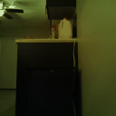
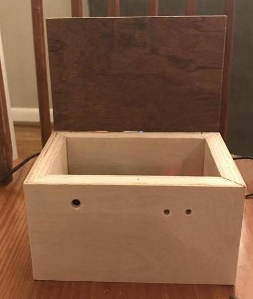
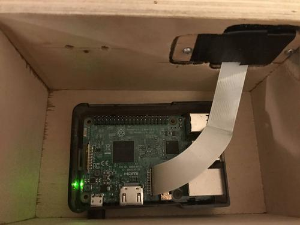
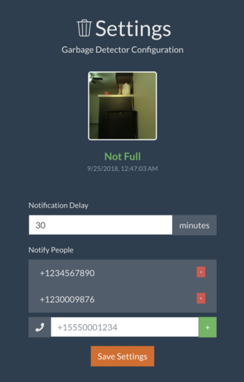

# Garbage Full Detector
This software runs on a raspberry pi to detect if a garbage is full. The raspberry pi has a camera hooked up
to take a picture of the can, then uses a deep learning model to predict if the garbage is full or not. If 
the garbage is full, it texts people a gif showing someone putting garbage in the can. Here's an example:

There are 3 different pieces of the system:

- **GarbageDetector** runs on the raspberry pi and is responsible for taking images, determining if 
  it's full, and sending out text messages. 

- **GarbageFullDetectorModel** is a toolchain for preprocessing images and training the classifier.
 
- **GarbageSettingsService** is a website that runs on the raspberry pi for configuring the settings
    of the device. Users can specify an interval of time to allow the person who filled the garbage to 
    empty it, as well as input phone numbers to text for notifications.

## The device
The specific model used for this project is the [Raspberry Pi 3 Model B](https://www.raspberrypi.org/products/raspberry-pi-3-model-b/) and [Arducam's Camera Module](https://www.amazon.com/Arducam-Megapixels-Sensor-OV5647-Raspberry/dp/B012V1HEP4/). A wooden enclosure 
was built to house the raspberry pi and to keep the camera in place. It just needs to be sitting on a
flat surface pointed at a garbage can.

## The site
The device is interacted with through the website. For now, you have to go to the IP of the raspberry
pi to see it. The site shows the status of the garbage can, the last picture it took, and settings. 

## Training
To collect data I took pictures of my garbage can both full and empty in different positions, with 
different lighting, different contents, different bags, etc. In total there were ~2000 images 
collected. ~1100 of it full, and ~900 of it empty. I collected about half the data by manually
moving the garbage can around and filling it up, and the other half passively by setting up the device
to take pictures every ten minutes over a few weeks. It was important to get real data in there as 
opposed to fake data.

Although there is a lot of variety in the training data, all of the images are of the same garbage can
in the same position in the same house. It is unlikely that any model trained on this data
alone would be able to classify any garbage can. Data of several different types of garbage cans would
need to be collected to make such a model.

The images are all resized down to 128x128 greyscale, and then sent through random perturbation to 
regularize the model. The idea is to change the images in ways that don't affect the class of the 
image (full/not full) but do change the pixels. This way the model will focus more on what's 
actually important to the problem. The images are shifted, brightened, darkened, contrasted, 
mirrored, and distorted with noise. The training program randomly does this to a random batch of
images before feeding them to the network.

The machine learning model is a convolutional neural network with 3 convolutional layers with 64
3x3 filters with max pooling between each. Then there's a fully connected layer with 50 neurons
followed by a softmax to the one-hot binary output. ReLU is used for each of the layers besides
the output.

After training for 30 epochs the model typically achieves around 97% on the training set and 
98% on the validation set. The higher accuracy on the validation may be due to there being
no perturbations in that set, meaning the model is looking at a clean image. Some of the 
random perturbations may be distorting the images so much that their class cannot be determined 
so they pollute the training data.

## Still to do (hopefully at some point)
 * Hook up LEDs to indicate full/not full
 * Add appropriate darkness threshold to decide not to classify
